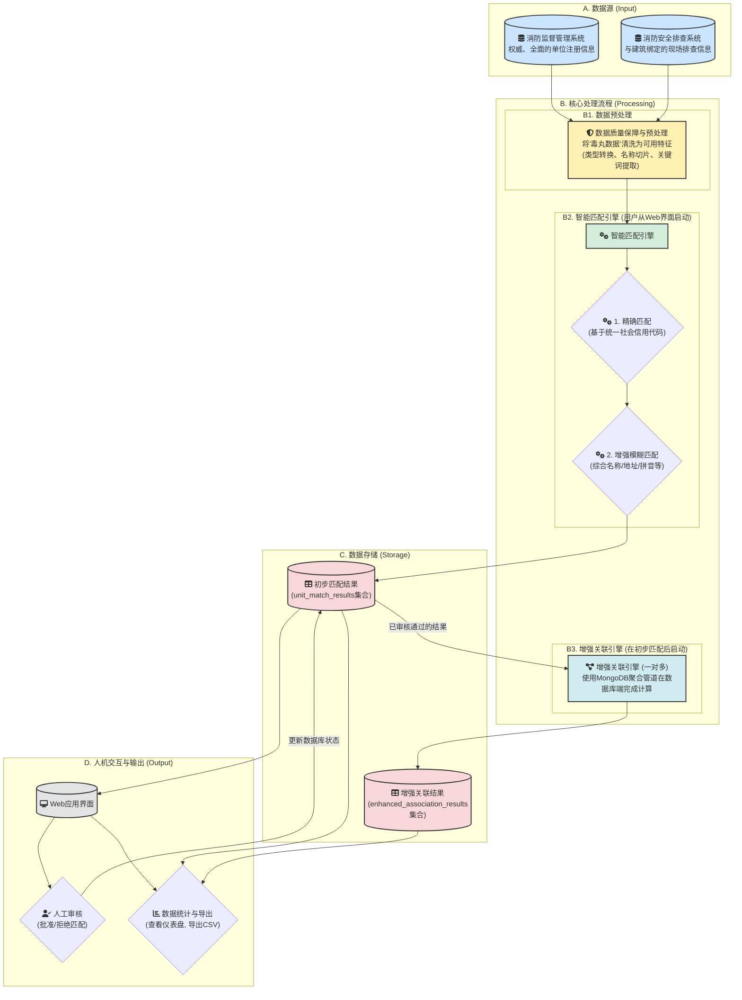

# 项目功能逻辑流程图

本文档旨在通过流程图的形式，清晰、直观地展示"消防单位建筑数据关联系统"的核心功能逻辑，便于初学者快速理解项目的数据流转和处理过程。

```mermaid
graph TD;
    subgraph "A. 数据源 (Input)"
        direction LR
        DS1[("fa:fa-database 消防监督管理系统<br>权威、全面的单位注册信息")]
        DS2[("fa:fa-database 消防安全排查系统<br>与建筑绑定的现场排查信息")]
    end

    subgraph "B. 核心处理流程 (Processing)"
        direction TB
        
        subgraph "B1. 数据预处理"
            Preprocessing["fa:fa-shield-alt 数据质量保障与预处理<br>将'毒丸数据'清洗为可用特征<br>(类型转换、名称切片、关键词提取)"]
        end

        subgraph "B2. 智能匹配引擎 (用户从Web界面启动)"
            MatchingEngine["fa:fa-cogs 智能匹配引擎"]
            MatchingEngine --> ExactMatch{"fa:fa-cogs 1. 精确匹配<br>(基于统一社会信用代码)"}
            ExactMatch --> FuzzyMatch{"fa:fa-cogs 2. 增强模糊匹配<br>(综合名称/地址/拼音等)"}
        end

        subgraph "B3. 增强关联引擎 (在初步匹配后启动)"
            EnhanceEngine["fa:fa-project-diagram 增强关联引擎 (一对多)<br>使用MongoDB聚合管道在数据库端完成计算"]
        end
    end

    subgraph "C. 数据存储 (Storage)"
        direction TB
        InitialResults[("fa:fa-table 初步匹配结果<br>(unit_match_results集合)")]
        EnhancedResults[("fa:fa-table 增强关联结果<br>(enhanced_association_results集合)")]
    end

    subgraph "D. 人机交互与输出 (Output)"
        direction TB
        WebApp[("fa:fa-desktop Web应用界面")]
        WebApp --> Review{"fa:fa-user-check 人工审核<br>(批准/拒绝匹配)"}
        WebApp --> StatsAndExport{"fa:fa-chart-bar 数据统计与导出<br>(查看仪表盘, 导出CSV)"}
    end

    %% 连接流程
    DS1 --> Preprocessing;
    DS2 --> Preprocessing;
    Preprocessing --> MatchingEngine;
    FuzzyMatch --> InitialResults;
    InitialResults --> WebApp;
    Review -- "更新数据库状态" --> InitialResults;
    
    InitialResults -- "已审核通过的结果" --> EnhanceEngine;
    EnhanceEngine --> EnhancedResults;
    
    InitialResults --> StatsAndExport;
    EnhancedResults --> StatsAndExport;
    
    %% 样式定义
    style DS1 fill:#cce5ff,stroke:#333,stroke-width:2px;
    style DS2 fill:#cce5ff,stroke:#333,stroke-width:2px;
    style Preprocessing fill:#fff0b3,stroke:#333,stroke-width:2px;
    style MatchingEngine fill:#d4edda,stroke:#333,stroke-width:2px;
    style EnhanceEngine fill:#d1ecf1,stroke:#333,stroke-width:2px;
    style InitialResults fill:#f8d7da,stroke:#333,stroke-width:2px;
    style EnhancedResults fill:#f8d7da,stroke:#333,stroke-width:2px;
    style WebApp fill:#e2e3e5,stroke:#333,stroke-width:2px;

```