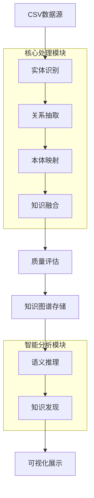

# 智能关联匹配系统V2.0项目开发计划
## 🚨 **重大架构更新 - 2025年08月08日**

### 🎯 **架构重构说明**
经过深入分析和实践验证，原有的**线性处理流程**不符合实际使用场景。现已完成**架构重构**，将系统改为**独立功能模块**架构。

#### **旧架构（线性流程）**：
```
CSV上传 → 数据分析 → 字段映射 → 知识图谱构建
   ↓         ↓         ↓         ↓
强制依赖   强制依赖   强制依赖   终点
```

#### **新架构（独立模块）**：
```
📊 数据源导入 (CSV上传) ← 独立功能，直接存储到MongoDB
    ↓
🔍 数据分析 ← 选择任意数据表进行分析 ← 独立功能
    ↓
🔗 字段映射 ← 选择多个数据表进行关联 ← 独立功能
    ↓
📈 知识图谱构建 ← 基于选定数据表构建 ← 独立功能
```

#### **新架构优势**
- ✅ **解耦独立**：每个功能都可以独立使用
- ✅ **灵活选择**：可以分析任意已存在的数据表
- ✅ **重复使用**：同一数据表可以多次分析、映射
- ✅ **用户友好**：符合实际使用场景和工作流程

### ✅ **已完成的重构工作（2025-08-08）**
1. **通用数据表选择器组件**：支持所有功能模块的数据表选择
2. **独立数据分析功能**：可选择任意数据表进行深度分析
3. **CSV上传优化**：独立数据源导入，支持大文件和容错处理
4. **相关后端API**：`/api/database_tables`、`/api/analyze_table`等

---

## 📋 项目概述

### 项目目标
将现有的消防单位建筑数据关联系统(V1.0)升级为具备**知识图谱生成和推理能力**的智能关联匹配平台(V2.0)，支持任意CSV数据源的上传、可配置的关联匹配，以及**自动化知识图谱构建和智能推理**。

### 核心升级内容
- CSV数据源支持与管理
- 可视化字段映射配置
- 动态匹配策略生成
- 图数据处理功能增强
- **🧠 知识图谱自动生成** ⭐ **核心新增**
- **🔮 智能推理和知识发现** ⭐ **核心新增**
- **📊 知识图谱可视化和查询** ⭐ **核心新增**
- 项目化管理功能
- 增强的用户界面
- API接口扩展

## 🧠 知识图谱核心功能设计 ⭐ **重要新增**

### 知识图谱 vs 现有图匹配的区别

#### **现有图匹配（V1.0）**：
- **目的**：实体匹配验证
- **结构**：简单的实体-属性二分图
- **分析**：基于共享属性的相似度计算
- **应用**：模糊匹配的二次验证

#### **知识图谱（V2.0新增）**：
- **目的**：知识表示、推理和发现
- **结构**：复杂的多层次语义网络
- **分析**：语义推理、规则推导、知识发现
- **应用**：智能问答、决策支持、趋势预测

### 知识图谱核心架构

#### 1. 知识图谱生成引擎
```python
# 新增：src/knowledge_graph/
├── __init__.py
├── kg_builder.py                # 知识图谱构建器
├── entity_extractor.py          # 实体抽取器
├── relation_extractor.py        # 关系抽取器
├── concept_hierarchy.py         # 概念层次构建
├── semantic_reasoner.py         # 语义推理引擎
├── knowledge_discovery.py       # 知识发现引擎
├── ontology_manager.py          # 本体管理器
└── kg_quality_assessor.py       # 知识图谱质量评估
```

#### 2. 知识图谱数据模型
```python
# 知识图谱三元组结构：(Subject, Predicate, Object)
class KnowledgeTriple:
    subject: Entity        # 主语实体
    predicate: Relation    # 谓语关系
    object: Entity         # 宾语实体
    confidence: float      # 置信度
    source: str           # 数据来源
    
class Entity:
    id: str               # 实体ID
    type: str             # 实体类型
    label: str            # 实体标签
    properties: Dict      # 实体属性
    aliases: List[str]    # 别名列表
    
class Relation:
    id: str               # 关系ID
    type: str             # 关系类型
    label: str            # 关系标签
    properties: Dict      # 关系属性
    domain: str           # 定义域
    range: str            # 值域
```

#### 3. 知识图谱生成流程


### 知识图谱核心功能

#### 1. 自动实体识别和抽取
```python
class EntityExtractor:
    """智能实体抽取器"""
    
    def __init__(self, config):
        self.ner_models = self._load_ner_models()  # 命名实体识别模型
        self.entity_types = config.get('entity_types', [
            'ORGANIZATION',    # 组织机构
            'PERSON',         # 人员
            'LOCATION',       # 地址位置
            'PRODUCT',        # 产品服务
            'TIME',           # 时间
            'MONEY',          # 金额
            'IDENTIFIER'      # 标识符（如信用代码）
        ])
    
    def extract_entities(self, text_data: Dict) -> List[Entity]:
        """从文本数据中抽取实体"""
        entities = []
        
        # 1. 基于规则的实体抽取
        rule_based_entities = self._extract_by_rules(text_data)
        
        # 2. 基于机器学习的实体抽取
        ml_based_entities = self._extract_by_ml(text_data)
        
        # 3. 基于字典的实体抽取
        dict_based_entities = self._extract_by_dict(text_data)
        
        # 4. 实体消歧和融合
        entities = self._merge_and_disambiguate([
            rule_based_entities,
            ml_based_entities,
            dict_based_entities
        ])
        
        return entities
    
    def _extract_company_entities(self, data: Dict) -> List[Entity]:
        """专门抽取公司实体"""
        company_indicators = [
            '有限公司', '股份公司', '集团', '企业', '公司',
            'Co.Ltd', 'Inc.', 'Corp.', 'LLC'
        ]
        # 实现公司实体抽取逻辑
        pass
```

#### 2. 关系自动发现和抽取
```python
class RelationExtractor:
    """关系抽取器"""
    
    def __init__(self, config):
        self.relation_patterns = self._load_relation_patterns()
        self.relation_types = [
            'LOCATED_IN',         # 位于
            'OWNED_BY',           # 拥有
            'EMPLOYED_BY',        # 雇佣
            'PARTNERSHIP',        # 合作关系
            'SUPPLY_CHAIN',       # 供应链关系
            'COMPETITION',        # 竞争关系
            'SUBSIDIARY',         # 子公司关系
            'INVESTMENT',         # 投资关系
            'REGULATION_BY',      # 监管关系
            'SIMILAR_TO'          # 相似关系
        ]
    
    def extract_relations(self, entities: List[Entity], 
                         match_results: List[Dict]) -> List[KnowledgeTriple]:
        """从匹配结果中抽取关系"""
        relations = []
        
        # 1. 基于匹配结果的关系抽取
        match_relations = self._extract_from_matches(entities, match_results)
        
        # 2. 基于共现模式的关系抽取
        cooccurrence_relations = self._extract_by_cooccurrence(entities)
        
        # 3. 基于语义规则的关系抽取
        semantic_relations = self._extract_by_semantics(entities)
        
        # 4. 基于外部知识库的关系增强
        enhanced_relations = self._enhance_with_external_kb(match_relations)
        
        relations.extend([
            match_relations,
            cooccurrence_relations, 
            semantic_relations,
            enhanced_relations
        ])
        
        return self._deduplicate_relations(relations)
```

#### 3. 语义推理引擎
```python
class SemanticReasoner:
    """语义推理引擎"""
    
    def __init__(self, kg_store):
        self.kg_store = kg_store
        self.reasoning_rules = self._load_reasoning_rules()
        self.inference_engine = self._init_inference_engine()
    
    def perform_reasoning(self, query_type: str, **kwargs) -> List[Dict]:
        """执行语义推理"""
        if query_type == 'transitive_closure':
            return self._transitive_reasoning(**kwargs)
        elif query_type == 'similarity_inference':
            return self._similarity_reasoning(**kwargs)
        elif query_type == 'path_analysis':
            return self._path_reasoning(**kwargs)
        elif query_type == 'anomaly_detection':
            return self._anomaly_reasoning(**kwargs)
    
    def _transitive_reasoning(self, relation_type: str, entity: str) -> List[Dict]:
        """传递性推理"""
        # 例：如果A位于B，B位于C，则推理A位于C
        results = []
        direct_relations = self.kg_store.find_relations(entity, relation_type)
        
        for relation in direct_relations:
            indirect_relations = self.kg_store.find_relations(
                relation.object, relation_type
            )
            for indirect in indirect_relations:
                # 构建传递性关系
                inferred_relation = KnowledgeTriple(
                    subject=entity,
                    predicate=relation_type,
                    object=indirect.object,
                    confidence=relation.confidence * indirect.confidence * 0.8,
                    source='transitive_inference'
                )
                results.append(inferred_relation)
        
        return results
    
    def _similarity_reasoning(self, entity: str, threshold: float = 0.8) -> List[Dict]:
        """相似性推理"""
        # 基于实体属性和关系模式推理相似实体
        similar_entities = []
        
        # 获取目标实体的特征向量
        target_features = self._extract_entity_features(entity)
        
        # 与知识图谱中所有实体进行相似性计算
        all_entities = self.kg_store.get_all_entities()
        for candidate in all_entities:
            if candidate.id == entity:
                continue
                
            candidate_features = self._extract_entity_features(candidate.id)
            similarity = self._calculate_semantic_similarity(
                target_features, candidate_features
            )
            
            if similarity >= threshold:
                similar_entities.append({
                    'entity': candidate,
                    'similarity': similarity,
                    'reasoning_path': self._explain_similarity(
                        target_features, candidate_features
                    )
                })
        
        return similar_entities
```

#### 4. 知识发现引擎
```python
class KnowledgeDiscovery:
    """知识发现引擎"""
    
    def __init__(self, kg_store, reasoner):
        self.kg_store = kg_store
        self.reasoner = reasoner
        self.discovery_algorithms = self._init_discovery_algorithms()
    
    def discover_patterns(self) -> Dict[str, List[Dict]]:
        """发现知识模式"""
        discoveries = {
            'clustering_patterns': self._discover_entity_clusters(),
            'relationship_patterns': self._discover_relation_patterns(),
            'anomaly_patterns': self._discover_anomalies(),
            'trend_patterns': self._discover_trends(),
            'hierarchy_patterns': self._discover_hierarchies()
        }
        return discoveries
    
    def _discover_entity_clusters(self) -> List[Dict]:
        """发现实体聚类模式"""
        # 基于实体属性和关系进行聚类分析
        entities = self.kg_store.get_all_entities()
        
        # 构建实体特征矩阵
        feature_matrix = self._build_entity_feature_matrix(entities)
        
        # 执行聚类算法
        clusters = self._perform_clustering(feature_matrix)
        
        # 分析聚类特征
        cluster_analysis = []
        for i, cluster in enumerate(clusters):
            cluster_info = {
                'cluster_id': f'cluster_{i}',
                'entities': cluster,
                'common_features': self._analyze_cluster_features(cluster),
                'representative_entity': self._find_cluster_centroid(cluster),
                'cluster_quality': self._evaluate_cluster_quality(cluster)
            }
            cluster_analysis.append(cluster_info)
        
        return cluster_analysis
    
    def _discover_relation_patterns(self) -> List[Dict]:
        """发现关系模式"""
        patterns = []
        
        # 1. 发现频繁关系模式
        frequent_patterns = self._mine_frequent_relation_patterns()
        
        # 2. 发现关系链模式
        chain_patterns = self._discover_relation_chains()
        
        # 3. 发现关系聚合模式
        aggregation_patterns = self._discover_relation_aggregations()
        
        patterns.extend([frequent_patterns, chain_patterns, aggregation_patterns])
        return patterns
    
    def generate_insights(self) -> List[Dict]:
        """生成业务洞察"""
        insights = []
        
        # 1. 市场竞争分析
        competition_insights = self._analyze_competition_landscape()
        
        # 2. 供应链分析
        supply_chain_insights = self._analyze_supply_chains()
        
        # 3. 风险关联分析
        risk_insights = self._analyze_risk_associations()
        
        # 4. 增长机会发现
        opportunity_insights = self._discover_growth_opportunities()
        
        insights.extend([
            competition_insights,
            supply_chain_insights,
            risk_insights,
            opportunity_insights
        ])
        
        return insights
```

## 📅 更新的开发计划时间表 ⭐ **架构重构版 - 2025-08-08**

### 🎯 **架构重构阶段（已完成 - 2025-08-08）**
**目标**：解耦线性流程，建立独立功能模块架构

#### ✅ **已完成的重构工作**
- ✅ **CSV上传功能独立化**：数据直接导入MongoDB，不依赖后续流程
- ✅ **数据表选择器组件**：通用的前端组件，支持所有功能模块
- ✅ **独立数据分析功能**：可选择任意数据表进行深度分析
- ✅ **后端API重构**：`/api/database_tables`、`/api/analyze_table`等

#### 🔄 **当前进行中（2025-08-08）**
- 🚧 **字段映射功能独立化**：支持多表选择和智能字段匹配
- 🚧 **知识图谱构建独立化**：基于任意选定数据表构建图谱
- ⏳ **导航菜单更新**：反映新的独立架构

### 🚀 第一阶段：独立功能模块完成（第1周 - 进行中）
**目标**：完成所有功能模块的独立化重构

#### **本周剩余任务（2025-08-08）**
1. **字段映射功能独立化** (今日重点)
   ```python
   # 新增页面：/standalone_field_mapping
   # 新增API：/api/get_table_fields, /api/suggest_field_mapping
   # 支持多表选择和智能字段匹配建议
   ```

2. **知识图谱构建功能独立化** (今日重点)
   ```python
   # 新增页面：/standalone_kg_builder
   # 重构：src/knowledge_graph/kg_builder.py
   # 支持基于任意选定数据表构建图谱
   ```

3. **导航菜单更新** (今日完成)
   ```html
   # 更新：src/web/templates/base.html
   # 新的独立功能模块导航结构
   ```

#### **预期本周完成效果**
- ✅ 用户可以灵活选择任意功能使用
- ✅ 不再被强制线性流程限制  
- ✅ 同一数据表可以重复分析和处理
- ✅ 更符合实际业务使用场景

---

### 📊 第二阶段：字段映射功能增强（第2周）
**目标**：基于新架构实现多表关联分析

#### **主要任务**
1. **多表关联分析界面** (2-3天)
   - 支持选择2-N个数据表进行关联
   - 智能字段匹配建议算法
   - 关联规则配置和预览
   - 关联质量评估和报告

2. **关联分析算法优化** (2天)
   - 基于数据类型的智能匹配
   - 字段语义相似度计算
   - 关联结果质量评分

3. **关联结果可视化** (1-2天)
   - 关联关系图谱展示
   - 匹配质量统计图表
   - 交互式结果探索

### 📈 第三阶段：知识图谱核心功能（第3-4周）
**目标**：基于选定数据表实现知识图谱生成

#### 第3周：知识图谱构建
1. **实体抽取器增强** (2-3天)
   - 支持任意数据表结构
   - 智能实体识别算法
   - 实体类型自动推断

2. **关系抽取器开发** (2-3天)
   - 基于字段映射的关系发现
   - 跨表关系识别
   - 关系置信度评估

#### 第4周：推理引擎开发
1. **语义推理引擎** (3-4天)
   - 基于图结构的推理
   - 规则驱动的知识发现
   - 推理结果验证

### 🎨 第四阶段：可视化和用户体验（第5-6周）
**目标**：完善用户界面和可视化功能

#### 第5周：知识图谱可视化
1. **交互式图谱浏览** (3-4天)
   - 多层次图谱展示
   - 节点和边的交互操作
   - 图谱查询和过滤

#### 第6周：系统集成和优化
1. **功能模块集成测试** (2-3天)
   - 所有独立功能模块协同测试
   - 端到端用户场景验证
   - 性能和稳定性测试

2. **性能优化** (2天)
   - 大数据集处理优化
   - 内存和CPU使用优化
   - 响应时间改进

3. **用户界面完善** (1-2天)
   - 统一的UI/UX设计
   - 用户操作流程优化
   - 错误处理和提示改进

**交付物**：
- CSV文件上传和解析功能
- **知识图谱基础数据模型** ⭐ **新增**
- 图功能完整性验证报告

#### 第2周：动态配置系统 + 实体关系抽取
**目标**：实现可配置的字段映射和**智能实体关系抽取**

**主要任务**：
1. **字段映射配置引擎** (2天)
   ```python
   # 新增模块：src/config_manager/
   ├── field_mapping.py         # 字段映射配置
   ├── strategy_generator.py    # 匹配策略生成器
   ├── kg_config_generator.py   # 知识图谱配置生成器 ⭐ **新增**
   └── config_validator.py      # 配置验证器
   ```

2. **实体关系抽取引擎** (3天) ⭐ **重要新增**
   ```python
   # 扩展：src/knowledge_graph/
   ├── entity_extractor.py     # 完善实体抽取逻辑
   ├── relation_extractor.py   # 完善关系抽取逻辑
   ├── concept_hierarchy.py    # 概念层次构建
   └── kg_builder.py           # 知识图谱构建器
   ```

**交付物**：
- 字段映射配置界面
- **智能实体识别功能** ⭐ **新增**
- **关系自动抽取功能** ⭐ **新增**

#### 第3周：Web界面基础升级 + 知识图谱配置
**目标**：开发项目向导和**知识图谱配置界面**

**主要任务**：
1. **项目向导界面** (2天)
   ```html
   # 新增模板：src/web/templates/v2/
   ├── project_wizard.html      # 项目创建向导
   ├── data_upload.html         # 数据上传界面
   ├── field_mapping.html       # 字段映射配置
   ├── kg_config.html           # 知识图谱配置界面 ⭐ **新增**
   └── strategy_config.html     # 策略配置界面
   ```

2. **知识图谱配置界面** (3天) ⭐ **重要新增**
   ```html
   # 新增：知识图谱专用界面
   ├── entity_config.html       # 实体配置界面
   ├── relation_config.html     # 关系配置界面
   ├── ontology_builder.html    # 本体构建界面
   └── kg_preview.html          # 知识图谱预览
   ```

**交付物**：
- 项目创建向导（含知识图谱配置）
- **实体类型配置界面** ⭐ **新增**
- **关系类型配置界面** ⭐ **新增**

#### 第4周：知识图谱构建引擎
**目标**：实现**知识图谱自动构建功能**

**主要任务**：
1. **知识图谱构建核心** (3-4天) ⭐ **核心功能**
   ```python
   # 完善：src/knowledge_graph/
   ├── kg_builder.py           # 知识图谱构建器
   ├── ontology_manager.py     # 本体管理器
   ├── kg_quality_assessor.py  # 质量评估器
   └── knowledge_fusion.py     # 知识融合引擎
   ```

2. **知识图谱存储系统** (1-2天)
   ```python
   # 新增：支持知识图谱的存储
   ├── kg_store.py             # 知识图谱存储引擎
   ├── triple_store.py         # 三元组存储
   └── kg_indexer.py           # 知识图谱索引
   ```

**交付物**：
- **知识图谱自动构建功能** ⭐ **核心**
- **知识质量评估系统** ⭐ **新增**
- 知识图谱存储系统

#### 第5周：集成测试和基础优化
**目标**：第一阶段功能集成和**知识图谱功能验证**

**主要任务**：
1. **功能集成测试** (2-3天)
   - 端到端功能测试
   - V1.0兼容性验证
   - **知识图谱构建功能测试** ⭐ **新增**

2. **知识图谱质量优化** (2天) ⭐ **重要新增**
   - 实体识别准确率优化
   - 关系抽取质量提升
   - 知识融合算法调优

**交付物**：
- 第一阶段完整功能
- **知识图谱构建验证报告** ⭐ **新增**
- 用户操作手册(知识图谱部分)

### 🎨 第二阶段：高级功能开发（4-5周）**[扩展1周]**

#### 第6周：语义推理引擎
**目标**：实现**智能语义推理和知识发现**

**主要任务**：
1. **语义推理引擎** (3-4天) ⭐ **核心功能**
   ```python
   # 新增：src/knowledge_graph/
   ├── semantic_reasoner.py    # 语义推理引擎
   ├── inference_rules.py      # 推理规则管理
   ├── reasoning_engine.py     # 推理执行引擎
   └── logic_processor.py      # 逻辑处理器
   ```

2. **推理规则配置** (1-2天)
   ```yaml
   # 新增：config/reasoning_rules.yaml
   reasoning_rules:
     transitive_rules:
       - rule: "LOCATED_IN(A,B) ∧ LOCATED_IN(B,C) → LOCATED_IN(A,C)"
       - confidence_decay: 0.8
     similarity_rules:
       - rule: "SIMILAR_INDUSTRY(A,B) ∧ SAME_LOCATION(A,B) → HIGH_SIMILARITY(A,B)"
   ```

**交付物**：
- **语义推理引擎** ⭐ **核心**
- 推理规则配置系统
- 推理结果验证工具

#### 第7周：知识发现和分析
**目标**：实现**智能知识发现和业务洞察**

**主要任务**：
1. **知识发现引擎** (3-4天) ⭐ **核心功能**
   ```python
   # 新增：src/knowledge_graph/
   ├── knowledge_discovery.py  # 知识发现引擎
   ├── pattern_miner.py        # 模式挖掘器
   ├── insight_generator.py    # 洞察生成器
   └── trend_analyzer.py       # 趋势分析器
   ```

2. **业务洞察生成** (1-2天)
   ```python
   # 业务分析模块
   ├── market_analyzer.py      # 市场分析
   ├── risk_analyzer.py        # 风险分析
   ├── opportunity_finder.py   # 机会发现
   └── competition_analyzer.py # 竞争分析
   ```

**交付物**：
- **知识发现引擎** ⭐ **核心**
- **业务洞察生成系统** ⭐ **新增**
- 模式挖掘和趋势分析

#### 第8周：知识图谱可视化
**目标**：实现**交互式知识图谱可视化和查询**

**主要任务**：
1. **知识图谱可视化** (3-4天) ⭐ **重要功能**
   ```javascript
   # 新增：src/web/static/js/v2/kg/
   ├── kg-visualizer.js        # 知识图谱可视化
   ├── kg-query-builder.js     # 查询构建器
   ├── kg-explorer.js          # 知识探索器
   └── kg-analytics.js         # 知识分析组件
   ```

2. **知识查询界面** (1-2天)
   ```html
   # 新增模板：
   ├── kg_dashboard.html       # 知识图谱看板
   ├── kg_explorer.html        # 知识探索界面
   ├── kg_query.html           # 知识查询界面
   └── kg_insights.html        # 业务洞察界面
   ```

**交付物**：
- **交互式知识图谱可视化** ⭐ **核心**
- **知识查询和探索界面** ⭐ **新增**
- 知识图谱分析工具

#### 第9周：智能问答系统
**目标**：实现**基于知识图谱的智能问答**

**主要任务**：
1. **智能问答引擎** (3-4天) ⭐ **高级功能**
   ```python
   # 新增：src/qa_system/
   ├── question_parser.py      # 问题解析器
   ├── query_generator.py      # 查询生成器
   ├── answer_generator.py     # 答案生成器
   └── qa_interface.py         # 问答接口
   ```

2. **自然语言处理** (1-2天)
   ```python
   # NLP处理模块
   ├── nlp_processor.py        # NLP处理器
   ├── intent_classifier.py    # 意图分类器
   ├── entity_linker.py        # 实体链接器
   └── response_formatter.py   # 回答格式化
   ```

**交付物**：
- **智能问答系统** ⭐ **高级功能**
- 自然语言查询处理
- 智能回答生成

#### 第10周：API和扩展性
**目标**：完善**知识图谱API**和系统扩展性

**主要任务**：
1. **知识图谱API** (2-3天) ⭐ **重要**
   ```python
   # 新增：src/api/kg_endpoints.py
   # 知识图谱相关API端点：
   POST /api/v2/kg/build              # 构建知识图谱
   GET  /api/v2/kg/query              # 知识查询
   GET  /api/v2/kg/insights           # 获取业务洞察
   POST /api/v2/kg/reasoning          # 语义推理
   GET  /api/v2/kg/visualize          # 可视化数据
   ```

2. **系统集成优化** (2天)
   - 知识图谱与匹配系统集成
   - 性能优化和内存管理
   - 错误处理和恢复机制

**交付物**：
- **完整的知识图谱API** ⭐ **重要**
- 系统集成优化
- API文档和使用指南

### 🎯 第三阶段：测试和优化（2-3周）

#### 第11-12周：系统测试和优化
**目标**：全面测试和**知识图谱功能优化**

**主要任务**：
1. **知识图谱专项测试** (3-4天) ⭐ **重要**
   ```python
   # 新增：tests/kg/
   ├── kg_construction_tests/   # 知识图谱构建测试
   ├── reasoning_tests/         # 推理功能测试
   ├── discovery_tests/         # 知识发现测试
   └── qa_system_tests/         # 问答系统测试
   ```

2. **性能优化** (2-3天)
   - 知识图谱构建性能优化
   - 推理引擎效率提升
   - 大规模数据处理优化

**交付物**：
- **知识图谱功能完整测试报告** ⭐
- 性能优化报告
- 用户验收测试结果

#### 第13周：文档和部署准备
**目标**：完善**知识图谱文档**和部署准备

**主要任务**：
1. **知识图谱文档** (3-4天) ⭐ **重要**
   ```markdown
   # 新增文档：docs/v2/kg/
   ├── kg_user_guide.md        # 知识图谱用户指南
   ├── reasoning_manual.md     # 推理功能手册
   ├── qa_system_guide.md      # 问答系统指南
   └── kg_api_reference.md     # 知识图谱API参考
   ```

**交付物**：
- **完整的知识图谱文档** ⭐
- 部署和运维指南
- 用户培训材料

## 🛠️ 技术实现细节 **[知识图谱技术栈]**

### 知识图谱技术选型

#### 1. 知识存储引擎
```python
# 技术选择：
primary_storage = "MongoDB"          # 主要数据存储
graph_storage = "Neo4j"              # 图数据库（可选）
triple_store = "Apache Jena"         # 三元组存储（可选）
vector_store = "Faiss"               # 向量索引
cache_layer = "Redis"                # 缓存层

# 存储架构：
class KnowledgeGraphStore:
    def __init__(self):
        self.mongo_client = MongoClient()     # 文档存储
        self.redis_client = RedisClient()    # 缓存
        self.vector_index = FaissIndex()     # 向量检索
        
    def store_knowledge_triple(self, triple: KnowledgeTriple):
        """存储知识三元组"""
        # 存储到MongoDB
        document = self._triple_to_document(triple)
        self.mongo_client.kg_triples.insert_one(document)
        
        # 构建向量索引
        embedding = self._generate_embedding(triple)
        self.vector_index.add_vector(triple.id, embedding)
        
        # 缓存热点数据
        if self._is_hot_data(triple):
            self.redis_client.set(f"triple:{triple.id}", triple.to_json())
```

#### 2. 自然语言处理
```python
# NLP技术栈：
nlp_library = "spaCy"                # 基础NLP处理
ner_model = "spaCy + 自定义模型"      # 命名实体识别
relation_extraction = "基于规则 + ML"  # 关系抽取
text_similarity = "sentence-transformers" # 文本相似度
chinese_processing = "jieba + HanLP"  # 中文处理

# 实体识别配置：
class EntityRecognizer:
    def __init__(self):
        self.nlp = spacy.load("zh_core_web_sm")
        self.custom_patterns = self._load_custom_patterns()
        self.domain_dict = self._load_domain_dictionary()
    
    def recognize_entities(self, text: str) -> List[Entity]:
        """识别文本中的实体"""
        # 1. 基于预训练模型的识别
        doc = self.nlp(text)
        entities = []
        
        for ent in doc.ents:
            entity = Entity(
                text=ent.text,
                label=ent.label_,
                start=ent.start_char,
                end=ent.end_char,
                confidence=self._calculate_confidence(ent)
            )
            entities.append(entity)
        
        # 2. 基于领域词典的识别
        domain_entities = self._recognize_domain_entities(text)
        entities.extend(domain_entities)
        
        # 3. 实体消歧和合并
        return self._merge_entities(entities)
```

#### 3. 推理引擎
```python
# 推理技术选择：
reasoning_framework = "自定义推理引擎"
rule_engine = "基于Prolog的规则引擎"
ml_reasoning = "Graph Neural Networks"
similarity_computation = "向量相似度 + 图结构相似度"

class ReasoningEngine:
    def __init__(self):
        self.rule_engine = self._init_rule_engine()
        self.gnn_model = self._load_gnn_model()
        self.similarity_engine = SimilarityEngine()
    
    def execute_reasoning(self, query: ReasoningQuery) -> List[ReasoningResult]:
        """执行推理查询"""
        if query.type == "rule_based":
            return self._rule_based_reasoning(query)
        elif query.type == "similarity":
            return self._similarity_reasoning(query)
        elif query.type == "path_finding":
            return self._path_reasoning(query)
        elif query.type == "clustering":
            return self._clustering_reasoning(query)
```

### 数据库设计扩展 **[知识图谱存储]**

#### 1. 知识三元组存储
```javascript
// kg_triples 集合
{
  "_id": ObjectId,
  "triple_id": "triple_001",
  "subject": {
    "entity_id": "entity_001",
    "type": "ORGANIZATION",
    "label": "北京科技有限公司",
    "properties": {...}
  },
  "predicate": {
    "relation_id": "rel_001",
    "type": "LOCATED_IN", 
    "label": "位于",
    "properties": {...}
  },
  "object": {
    "entity_id": "entity_002",
    "type": "LOCATION",
    "label": "北京市朝阳区",
    "properties": {...}
  },
  "confidence": 0.95,
  "source": "entity_extraction",
  "created_time": ISODate,
  "verified": true
}
```

#### 2. 推理结果存储
```javascript
// reasoning_results 集合
{
  "_id": ObjectId,
  "reasoning_id": "reasoning_001",
  "query": {
    "type": "transitive_closure",
    "subject": "entity_001",
    "relation": "SUPPLY_CHAIN"
  },
  "results": [
    {
      "inferred_triple": {...},
      "reasoning_path": ["triple_001", "triple_002"],
      "confidence": 0.8,
      "explanation": "通过传递性推理发现的供应链关系"
    }
  ],
  "execution_time": 150, // 毫秒
  "created_time": ISODate
}
```

#### 3. 业务洞察存储
```javascript
// business_insights 集合
{
  "_id": ObjectId,
  "insight_id": "insight_001",
  "project_id": "proj_20240804_001",
  "insight_type": "market_competition",
  "title": "同行业竞争关系发现",
  "description": "发现了5家在同一地区的同行业企业",
  "evidence": [
    {
      "type": "entity_cluster",
      "entities": ["entity_001", "entity_002", "entity_003"],
      "common_features": ["same_industry", "same_location"]
    }
  ],
  "confidence": 0.85,
  "impact_level": "high", // low, medium, high
  "actionable_recommendations": [
    "建议进一步分析这些企业的合作可能性",
    "监控这些企业的市场动态"
  ],
  "created_time": ISODate,
  "status": "active" // active, archived, dismissed
}
```

### API接口设计 **[知识图谱API]**

#### 1. 知识图谱构建API
```python
# 知识图谱构建和管理
POST   /api/v2/kg/build                    # 构建知识图谱
GET    /api/v2/kg/build/status             # 获取构建状态
POST   /api/v2/kg/build/incremental        # 增量构建
DELETE /api/v2/kg/{project_id}             # 删除知识图谱

# 实体和关系管理
GET    /api/v2/kg/entities                 # 获取实体列表
POST   /api/v2/kg/entities                 # 创建实体
PUT    /api/v2/kg/entities/{entity_id}     # 更新实体
GET    /api/v2/kg/relations                # 获取关系列表
POST   /api/v2/kg/relations                # 创建关系
```

#### 2. 知识查询和推理API
```python
# 知识查询
POST   /api/v2/kg/query/sparql             # SPARQL查询
POST   /api/v2/kg/query/cypher             # Cypher查询
POST   /api/v2/kg/query/natural            # 自然语言查询
GET    /api/v2/kg/entity/{id}/relations    # 获取实体关系

# 语义推理
POST   /api/v2/kg/reasoning/transitive     # 传递性推理
POST   /api/v2/kg/reasoning/similarity     # 相似性推理
POST   /api/v2/kg/reasoning/path           # 路径推理
GET    /api/v2/kg/reasoning/results/{id}   # 获取推理结果
```

#### 3. 知识发现和洞察API
```python
# 知识发现
POST   /api/v2/kg/discovery/patterns       # 模式发现
POST   /api/v2/kg/discovery/clusters       # 聚类发现
POST   /api/v2/kg/discovery/anomalies      # 异常发现
GET    /api/v2/kg/discovery/trends         # 趋势分析

# 业务洞察
GET    /api/v2/kg/insights                 # 获取业务洞察
POST   /api/v2/kg/insights/generate        # 生成新洞察
PUT    /api/v2/kg/insights/{id}/feedback   # 洞察反馈
GET    /api/v2/kg/insights/recommendations # 获取建议
```

#### 4. 问答系统API
```python
# 智能问答
POST   /api/v2/qa/ask                      # 提问
GET    /api/v2/qa/history                  # 问答历史
POST   /api/v2/qa/feedback                 # 答案反馈
GET    /api/v2/qa/suggestions              # 问题建议
```

## 📊 资源需求和风险评估 **[知识图谱专项]**

### 开发资源需求 **[已调整]**
- **开发时间**：11-14周 (约2.5-3.5个月) ⚠️ **增加2-3周**
- **开发人员**：1名全栈开发人员 + **知识图谱专业知识** ⚠️
- **技术要求**：NLP、图算法、推理引擎、可视化 ⚠️ **新增**
- **硬件要求**：32GB+内存（知识图谱+推理需要大内存）⚠️ **升级**

### 技术风险评估 **[知识图谱风险]**

#### 🔴 高风险项 **[新增知识图谱风险]**
1. **知识图谱构建复杂性** ⚠️ **新增最高风险**
   - 风险：实体识别准确率、关系抽取质量、知识融合复杂度
   - 缓解措施：分阶段实现、质量评估、人工校验机制

2. **推理引擎性能** ⚠️ **新增高风险**
   - 风险：大规模知识图谱的推理计算复杂度
   - 缓解措施：推理规则优化、分布式计算、结果缓存

3. **知识质量控制** ⚠️ **新增高风险**
   - 风险：自动抽取的知识质量参差不齐
   - 缓解措施：多重验证、置信度评估、人工审核

#### 🟡 中风险项 **[知识图谱相关]**
1. **自然语言处理准确性** ⚠️ **新增中风险**
   - 风险：中文实体识别和关系抽取准确率
   - 缓解措施：领域定制、模型微调、规则增强

2. **知识图谱可视化性能** ⚠️ **新增中风险**
   - 风险：大规模知识图谱的Web端可视化
   - 缓解措施：分层渲染、交互优化、数据分页

### 质量保证措施 **[知识图谱专项]**

#### 1. 知识图谱专项测试 ⚠️ **重要新增**
- **构建质量测试**：实体识别准确率>90%，关系抽取准确率>85%
- **推理正确性测试**：推理结果的逻辑一致性验证
- **性能压力测试**：百万级三元组的查询和推理性能
- **可视化测试**：万级节点的图可视化稳定性

#### 2. 知识质量评估 ⚠️ **重要新增**
- **自动质量评估**：置信度评分、一致性检查、完整性验证
- **人工质量审核**：抽样验证、专家评估、用户反馈
- **持续质量改进**：质量监控、自动修正、增量优化

## 📈 预期成果和验收标准 **[知识图谱功能]**

### 功能性验收标准 **[已更新]**
✅ **基础功能**
- [ ] 支持CSV/Excel文件上传和解析
- [ ] 自动识别字段类型和数据质量
- [ ] 可视化字段映射配置
- [ ] 动态匹配策略生成
- [ ] V1.0图匹配功能完全保留
- [ ] 项目保存和复用功能

✅ **知识图谱核心功能** ⭐ **重要新增**
- [ ] 自动实体识别和抽取（准确率>90%）
- [ ] 智能关系发现和抽取（准确率>85%）
- [ ] 知识图谱自动构建和质量评估
- [ ] 语义推理和知识发现功能
- [ ] 交互式知识图谱可视化
- [ ] 基于知识图谱的智能问答

✅ **高级功能**  
- [ ] 智能算法推荐和参数调优
- [ ] 实时预览和结果分析
- [ ] 批量审核和质量评估
- [ ] 完整的API接口和插件系统
- [ ] 业务洞察生成和趋势分析

### 性能验收标准 **[知识图谱性能]**
- **文件处理**：支持100MB以内的CSV文件 ✓
- **匹配速度**：10万条记录处理时间<30分钟 ✓
- **知识图谱构建**：10万实体图谱构建<20分钟 ⚠️ **新增**
- **推理查询响应**：复杂推理查询响应<10秒 ⚠️ **新增**
- **问答系统响应**：自然语言问答响应<5秒 ⚠️ **新增**
- **内存使用**：峰值内存使用<16GB（含知识图谱）⚠️ **调整**
- **Web响应时间**：Web界面响应时间<3秒 ✓
- **并发支持**：支持5个并发用户操作 ✓

### 知识图谱专项验收 ⚠️ **重要新增**
- **构建质量**：实体识别准确率>90%，关系抽取准确率>85%
- **推理准确性**：推理结果逻辑一致性>95%
- **知识覆盖度**：能发现数据中95%以上的核心实体和关系
- **可视化能力**：支持1万节点的流畅可视化交互
- **问答准确性**：简单事实性问题回答准确率>90%
- **洞察价值**：生成的业务洞察有效性>80%

## 🚀 实施建议 **[知识图谱优先级]**

### 1. 开发优先级 **[已调整]**
**Phase 1 (基础)**：CSV上传 → 字段映射 → 基础匹配 → **实体关系抽取** ⭐
**Phase 2 (核心)**：**知识图谱构建** ⭐ → **语义推理** ⭐ → **知识发现** ⭐
**Phase 3 (高级)**：**智能问答** ⭐ → **可视化** ⭐ → API接口 → 高级功能

### 2. 知识图谱实施策略 ⭐ **重要新增**
- **第1-2周**：建立知识图谱基础架构和实体关系抽取
- **第4周**：实现知识图谱自动构建功能
- **第6周**：开发语义推理引擎
- **第7周**：实现知识发现和业务洞察
- **第8-9周**：完善可视化和问答系统
- **全程**：保持知识质量评估和持续优化

### 3. 成功关键因素 ⭐ **知识图谱专项**
- **领域知识整合**：充分理解业务领域的实体和关系特征
- **质量优先原则**：知识质量比数量更重要
- **渐进式构建**：从简单规则开始，逐步增加复杂性
- **用户反馈驱动**：基于用户使用反馈持续优化知识质量

---

## 📋 总结 **[知识图谱增强版]**

### 关键增强内容 ⭐
1. **知识图谱自动构建**：从CSV数据自动构建领域知识图谱
2. **智能语义推理**：基于图结构和规则的智能推理能力
3. **知识发现引擎**：自动发现隐藏模式和业务洞察
4. **智能问答系统**：基于知识图谱的自然语言问答
5. **可视化知识探索**：交互式知识图谱可视化和探索

### 核心技术价值 ⭐
- **知识表示**：将数据升级为结构化知识
- **智能推理**：发现数据中的隐含关系和规律
- **业务洞察**：自动生成具有商业价值的洞察
- **决策支持**：基于知识图谱的智能决策支持
- **知识积累**：建立可持续增长的企业知识资产

### 商业竞争优势 ⭐
- **技术领先性**：业界领先的知识图谱技术
- **智能化程度**：从数据处理升级到知识智能
- **应用场景扩展**：从数据匹配扩展到知识服务
- **长期价值**：知识图谱可持续积累和增值

这个知识图谱增强版将使V2.0系统从数据匹配平台升级为真正的**智能知识平台**，具备知识表示、推理、发现和应用的完整能力！

<function_calls>
<invoke name="todo_write">
<parameter name="merge">true